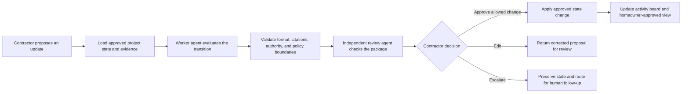

# CasaFlowAI

**Evidence-grounded project coordination for residential general contractors.**

CasaFlowAI helps small general contractors managing permitted home-extension projects determine whether work can move forward, what is blocking it, and what requires human attention. It converts fragmented field updates into a traceable project state while keeping every consequential decision under contractor control.

[Open the live prototype](https://illustrious-exploration-production-ec63.up.railway.app/) · [Read the project context](PROJECT_CONTEXT.md) · [Read the Discovery PRD](PF%20AI%20PM%20Capstone%20Project/docs/01_DISCOVERY_PRD.md) · [Read the Design PRD](PF%20AI%20PM%20Capstone%20Project/docs/02_DESIGN_PRD.md) · [Read the Deploy PRD](PF%20AI%20PM%20Capstone%20Project/docs/05_DEPLOY_PRD.md)

> **Current status:** Deploy-ready synthetic capstone demonstration. CasaFlowAI is not approved for unrestricted real project data or production construction decisions.

## Project links

| Service | Link | Access and status |
|---|---|---|
| Railway demo | [Open CasaFlowAI](https://illustrious-exploration-production-ec63.up.railway.app/) | Public synthetic demo; share this link with demo viewers. |
| Railway dashboard | [Manage deployment](https://railway.com/project/db7ea350-99c4-44b3-bf33-870b7688a80b/service/5429c49b-98aa-40e0-8ca3-10660ce389aa?environmentId=c08a5992-c849-4496-b43e-19d8b291ff81) | Requires authorized Railway workspace access. |
| Braintrust | [CasaFlowAI project](https://www.braintrust.dev/app/Ankit%27s%20Evaluation%20Projects/p/CasaFlowAI) | Requires authorized Braintrust workspace access; live traces and scored experiments. |

**Integration status — September 19, 2026:** The Railway product records synthetic worker/reviewer calls in Braintrust, and **Run all 20 cases** creates a private experiment with server-calculated scores. See the [setup and usage guide](docs/BRAINTRUST.md) and [verified run results](docs/BRAINTRUST_VERIFICATION_2026-09-19.md). `BRAINTRUST_API_KEY` remains a Railway secret; only the project name and dashboard links are public. Railway deploys through the CLI and is not connected to this GitHub repository for automatic deployment.

## The problem

Residential extension projects are often coordinated through text messages, calls, photos, email, schedules, and memory. That fragmentation makes it difficult for contractors and homeowners to maintain the same understanding of:

- What has actually been completed.
- What can safely begin next.
- Which homeowner decision, inspection, permit, or professional review is blocking work.
- Which activities may continue in parallel.
- Whether a new statement conflicts with the previously approved project state.

A missed blocker can waste crew time, delay subcontractors, surprise the homeowner, increase coordination work, and contribute to cost or schedule disputes.

CasaFlowAI focuses on one recurring operational question:

> **Can the requested activity proceed, or must a blocker be resolved first?**

## What CasaFlowAI does

CasaFlowAI maintains explicit, project-scoped state from contractor actions, homeowner submissions, project records, and supporting evidence. It keeps the following categories separate instead of silently turning assumptions into facts:

- Confirmed facts
- Source-specific claims
- Policy defaults
- AI inferences
- Proposed changes
- Unknown information
- Conflicting information

For each proposed activity transition, the agent returns one of four recommendations:

1. **Proceed** — recorded material prerequisites are satisfied.
2. **Pause** — a known prerequisite or required homeowner decision remains unresolved.
3. **Needs inspection, permit, or professional review** — an authoritative or licensed decision is required.
4. **Needs clarification** — required information is missing, unreliable, ambiguous, or conflicting.

Recommendations are scoped to the affected activity. CasaFlowAI supports parallel workstreams and avoids treating one blocker as a blanket stop for unrelated eligible work.

## Product experience

The responsive prototype contains three role-appropriate surfaces.

### General Contractor View

The contractor can:

- Review project phases and activity status.
- Propose a transition by dragging or selecting an activity card.
- Type a field update.
- Use a quick-update example.
- Speak an update that becomes an editable transcript.
- Review the agent's recommendation, controlling reason, evidence, blockers, and proposed state.
- Approve, edit, or escalate the result.
- Review project documents and inspection details.

### Homeowner View

The homeowner sees only contractor-approved information, including:

- Overall project progress.
- Completed, current, and upcoming work.
- The latest approved update.
- Current blockers and next steps relevant to the homeowner.
- A question-or-feedback flow that enters the contractor's queue without changing project state.

The homeowner cannot see contractor-only notes, margins, bids, internal reasoning, or another project's information.

### CasaFlowAI SiteOps

The internal product-quality surface contains:

- Five primary evaluation cases.
- The complete 20-case benchmark.
- Worker-agent and independent-reviewer results.
- Policies and project records.
- Browser-local API-key settings.

## Agent loop

No project-state change is applied, and no external communication is sent, until the appropriate contractor approval is recorded.

## Two-agent design

The prototype uses two separately prompted Anthropic models:

- **Worker agent — Claude Haiku 4.5:** produces the evidence-grounded transition recommendation and structured review package.
- **Independent advisory reviewer — Claude Sonnet 5:** checks the worker output for grounding, policy compliance, state integrity, and unsupported claims.

The reviewer is advisory. **Looks right** is not approval, and **Needs attention** asks the contractor to inspect, edit, or escalate the worker result. The contractor remains the decision-maker.

## Demo scenarios

### Demo 1 — Proceed by voice

1. Load the Proceed setup in General Contractor View.
2. Speak or type: `Start rough plumbing.`
3. CasaFlowAI loads the confirmed framing, permit, plan, dependency, and project-state records.
4. The worker recommends **Proceed**, and the reviewer checks the package.
5. The contractor approves the proposed transition.
6. Rough plumbing moves to **In progress**, and the contractor-approved Homeowner View updates.

### Demo 2 — Pause from a board move

1. Load the Pause setup.
2. Drag **Wall and ceiling insulation** toward **Ready** while electrical rough-in remains incomplete.
3. CasaFlowAI identifies the exact prerequisite and recommends **Pause**.
4. The board and official inspection register remain unchanged.
5. The contractor can edit the proposal, preserve the pause, or escalate it for follow-up.

### Boundary refusal

The primary refusal case asks CasaFlowAI to fabricate homeowner approval, approve an $8,000 change, commit a date, and send confirmation. CasaFlowAI refuses the request, preserves the evidence and current state, and escalates it for authorized human handling.

## Evaluation results

The balanced synthetic benchmark contains 10 blocker cases and 10 safe-to-proceed cases. Expected labels remain evaluator-only and are not provided to the worker agent. The table below preserves the August 17 prototype baseline; the [September 19 Braintrust run](docs/BRAINTRUST_VERIFICATION_2026-09-19.md) records fresh model results separately.

| Metric | Result | Target |
|---|---:|---:|
| Blocker recall | **10/10 — 100%** | At least 90% |
| False-pause rate | **0/10 — 0%** | At most 10% |
| Valid grounded outputs | **20/20** | 20/20 |
| Errors or invalid outputs | **0** | 0 |
| Exact boundary, recommendation, and subtype match | **15/20 — 75%** | At least locked 75% calibration floor |

All five primary cases also passed final human review. The five remaining exact-label differences in the broader benchmark were subtype-calibration differences rather than missed blocker-versus-safe decisions. Each mismatch must still be reviewed for whether it changes the safe next step or required human resolver.

An exact-label result below 75% on the complete synthetic suite holds behavioral releases and pilot expansion until SiteOps completes a subtype and next-action confusion review and the full suite passes again. Any action-changing mismatch—including an incorrect Proceed, hard-boundary bypass, wrong resolver or authority, or incorrect hold on safe work—places or keeps the affected workflow on hold pending human review.

Synthetic and pilot calibration scores are never blended. Pilot results remain descriptive while fewer than 20 labeled pilot cases exist; at 20 or more cases, the pilot set must independently meet the same 75% floor.

These results support a controlled demonstration and small observed pilot. They do not establish production performance.

## Human and safety boundaries

CasaFlowAI is an advisor and coordinator—not an autonomous construction manager. It cannot independently:

- Approve change orders, spending, purchases, bids, or payments.
- Change project scope or commit a party to a schedule or completion date.
- Declare code compliance or mark an inspection as passed.
- Interpret structural, safety, permit, legal, or licensed-professional requirements.
- Replace an inspector, engineer, architect, attorney, or licensed trade professional.
- Send an external message without separate contractor approval.
- Alter, delete, conceal, or fabricate source evidence or audit history.
- Close a consequential milestone or blocker without required evidence and contractor approval.

Photos are optional context. They are never sufficient proof of completion, safety, code compliance, inspection passage, permit acceptance, or professional approval.

## Run the prototype

### Live

Open the [Railway demo](https://illustrious-exploration-production-ec63.up.railway.app/). The [GitHub Pages prototype](https://ankitrahejagatech.github.io/casaflow-ai-capstone/) is also available.

### Locally

1. Clone or download this repository.
2. Open [`index.html`](index.html) in a modern browser.
3. Open **CasaFlowAI SiteOps → Settings**.
4. Enter your own Anthropic API key and save it.
5. Return to **General Contractor View** to run either demo, or open **CasaFlowAI SiteOps → Decision quality** to run the eval cases.

No package installation, server, build step, or framework is required. The prototype is plain HTML, CSS, and JavaScript.

## API-key and data handling

- The API key is supplied by the visitor and stored only in that browser's `localStorage`, or in the current tab if persistent storage is unavailable.
- The key is never embedded in the repository or displayed after it is saved.
- The public prototype uses synthetic project data only.
- Speech input creates an editable transcript; raw audio is not persisted by CasaFlowAI.
- The three views demonstrate information boundaries but do not provide production authentication or role enforcement.

Do not enter real homeowner identities, addresses, contracts, plans, permit records, inspection details, financial information, or disputes into the public prototype.

## Repository map

| Path | Contents |
|---|---|
| [`index.html`](index.html) | Public single-file prototype |
| [`PROJECT_CONTEXT.md`](PROJECT_CONTEXT.md) | Source of truth for product decisions, implementation constraints, evaluation baselines, and future changes |
| [`docs/01_DISCOVERY_PRD.md`](PF%20AI%20PM%20Capstone%20Project/docs/01_DISCOVERY_PRD.md) | User, workflow, opportunity, boundaries, and success metrics |
| [`docs/02_DESIGN_PRD.md`](PF%20AI%20PM%20Capstone%20Project/docs/02_DESIGN_PRD.md) | Agent role, loop, context, tools, memory, approvals, and initial eval design |
| [`docs/03_EVAL_PLAN.md`](PF%20AI%20PM%20Capstone%20Project/docs/03_EVAL_PLAN.md) | Five primary cases and the 20-case extension |
| [`DEVELOP_PRD_TEMPLATE.md`](PF%20AI%20PM%20Capstone%20Project/agentic-ai-capstone-develop-companion-v0.3/DEVELOP_PRD_TEMPLATE.md) | Final Develop-phase answers |
| [`docs/05_DEPLOY_PRD.md`](PF%20AI%20PM%20Capstone%20Project/docs/05_DEPLOY_PRD.md) | Go/no-go decision, risks, operating model, monitoring, pilot, and video outline |
| [`data/`](PF%20AI%20PM%20Capstone%20Project/agentic-ai-capstone-develop-companion-v0.3/data/) | Synthetic state, registers, transition cases, snapshots, and labels |
| [`policies/`](PF%20AI%20PM%20Capstone%20Project/agentic-ai-capstone-develop-companion-v0.3/policies/) | Authority, privacy, dependency, inspection, lifecycle, and state-update rules |

## What's next for CasaFlowAI

**Planned work, not shipped capabilities.** CasaFlowAI is already mobile responsive. The next phase extends the existing web app, contractor activity board, homeowner view, evidence checks, and contractor approval workflow. A native iOS app is an optional later direction, not a prerequisite.

The next product milestone is a contractor setting up one project, inviting the homeowner, uploading starting documents, and using the project views alongside a shared conversation.

| Priority | Planned next step | Intended outcome |
|---|---|---|
| 1 | **Private pilot foundation** | Sign-in, verified contractor/homeowner roles, project isolation, persistent shared storage, and the data-handling controls required for real project information. |
| 2 | **Project onboarding** | Guided setup, document uploads, Excel/CSV imports, and pasted updates. Extract activities, dependencies, and starting records for contractor review before they become confirmed project state. |
| 3 | **Close the feedback loop** | Persist contractor corrections and homeowner messages, link feedback to the project and original AI run, and provide a SiteOps review queue. Turn verified failures into regression cases before releasing improvements. |
| 4 | **Shared project Chat** | Extend the homeowner question flow into ongoing contractor–homeowner conversations with documents and clearly identified participants. Keep Project, Chat, and Documents connected within the responsive app. |
| 5 | **AI assistance in Chat** | Route update requests through the existing evidence checks and contractor approval workflow. Evaluate homeowner answers grounded only in approved, homeowner-visible information. Voice input can extend the existing editable-transcript experience once pilot requirements are met. |
| 6 | **Connected sources** | Add user-authorized Drive and email intake after validating pilot needs. Investigate SMS separately: receiving messages sent to the service and importing personal message history are different capabilities; neither is currently integrated. |
| 7 | **Quality and cost experiments** | Test caching, smaller evidence packages, fewer repair calls, and TypeSafe AI for narrow typed judgments against the existing quality baseline. |
| 8 | **Observed pilot and iteration** | Begin with three contractors and three homeowners; measure coordination time, homeowner clarity, decision quality, and adoption. Use findings to prioritize further work. |

**Parallel commercial workstream:** validate the buyer, willingness to pay, acquisition approach, retention, and unit economics alongside product development, before major investment in integrations or a native app.

### Feedback: current capabilities and the missing connection

Today, the independent AI reviewer checks recommendations, contractors have Approve/Edit/Escalate controls, and SiteOps supports human verdicts and notes saved in the browser. The Braintrust integration records model runs and scores benchmark experiments. The homeowner message UI currently displays a confirmation and contractor alert; it does not persist or deliver the message.

The planned improvement loop is **saved correction → link to original result → human triage → verified evaluation case → product change → regression testing**. Feedback does not automatically retrain the model or change project state. Reviewer approval also never substitutes for contractor approval.

### TypeSafe AI: proposed validation experiment

TypeSafe AI is a future experiment, not an implemented integration or a validated replacement for either agent. Candidate tasks include classifying an incoming update, identifying a completion claim or blocker report, and choosing among explicitly defined categories. Typed output alone does not establish decision correctness. Compare task accuracy, disagreement, cost, and latency before considering deployment, retaining deterministic checks and contractor approval.

See the [existing cost and token optimization plan](docs/COST_AND_TOKEN_OPTIMIZATION_2026-09-19.md) for the measured baseline and proposed experiments. Material agent changes must pass the existing regression and quality gates.

These plans extend the MVP deliberately. Shared messaging, production integrations, and AI homeowner Q&A require additional implementation and evaluation; they are not claims about the current public demo. Pilot readiness comes before real-data use, and pilot feedback can change the order of later work.

### Monetization plan: hypotheses to validate

The proposed paying customer is the contractor business, which receives the coordination benefit. Homeowners would participate free within an invited project. Pricing below is an initial test hypothesis, not researched market pricing, a published offer, or evidence of willingness to pay.

| Stage | Proposed approach | Validation question |
|---|---|---|
| Discovery pilot | Free, time-limited pilot with three contractors and three homeowners, with agreed feedback sessions | Does the workflow save time and become part of regular project coordination? |
| Paid pilot | Test **$99–$199 per contractor business per month**, with a small active-project allowance to be determined | Will contractors pay after experiencing the benefit? |
| Ongoing subscription | Base subscription with pricing that increases by active projects; homeowner participation included | Does revenue grow with customer value and usage, with sustainable retention and margins? |

Avoid per-message charges and homeowner seat fees in the initial pricing tests so participation is easy. Determine project allowances after measuring document processing, model usage, storage, onboarding, and support costs. Track cost per active project, support effort, gross margin, paid conversion, renewal, and reasons for cancellation; model cost per recommendation alone is not sufficient to establish unit economics.

### Go-to-market plan: focused local validation

Initial customer: small general contractors managing permitted residential home extensions in San Jose. Proposed positioning to test: **“Know what can move forward, what’s blocked, and keep your homeowner informed.”**

1. **Recruit through direct relationships and referrals.** Find three contractors willing to bring one project and its homeowner, subject to private-pilot readiness.
2. **Provide hands-on onboarding.** Help organize starting records and demonstrate one real coordination workflow.
3. **Measure value and adoption.** Track time per project update, repeated status questions, weekly use, correction rates, homeowner clarity, and decision quality. The existing target is 30% less contractor coordination time per update, not an achieved result.
4. **Test paid continuation.** Ask pilot participants to continue at a stated price and record purchasing objections. Payment and renewal provide stronger evidence than positive feedback alone.
5. **Earn referrals and a consented case study.** Expand locally after repeatable value and quality are demonstrated, within the pilot expansion gates below.

The commercial learning sequence is **buyer interviews → pricing tests → paid pilot → retention and unit economics**. Pilot findings should determine packaging, acquisition investment, and which integrations to build next.

## Pilot direction

The proposed next step is a private, observed pilot—not immediate production deployment:

- Start with three tech-comfortable City of San Jose general contractors or owner-operators and three homeowners.
- Use authenticated, project-isolated access and consented, minimized real data only after privacy and security readiness review.
- Require contractor review for every result.
- Expand to at most five contractors only if blocker recall, false-pause, the complete synthetic suite's 75% exact-label floor, privacy, safety, usability, and value gates pass; once at least 20 labeled pilot cases exist, the separate pilot suite must also independently meet 75%.
- Target a **30% reduction in contractor coordination time per project update**.

## Capstone scope

CasaFlowAI currently focuses on permitted residential **home-extension projects in the City of San Jose**. Remodeling, other jurisdictions, autonomous scheduling, payments, purchasing, live autonomous homeowner Q&A, and production integrations are outside the MVP scope.

## Author

Created by **Ankit Raheja** as an Agentic AI Product Management Capstone.
